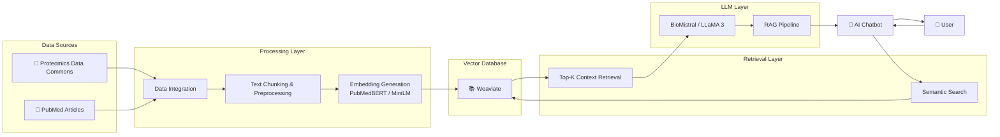

# 🧬 RAG-based AI Chatbot for Proteomics Data (PDC)
## 🏗️ System Architecture

```mermaid
flowchart LR

subgraph Data Sources
DS1[🧬 Proteomics Data Commons]
DS2[📄 PubMed Articles]
end

subgraph Processing Layer
P1[Data Integration]
P2[Text Chunking & Preprocessing]
P3[Embedding Generation<br/>PubMedBERT / MiniLM]
end

subgraph Vector Database
V1[📚 Weaviate]
end

subgraph Retrieval Layer
R1[Semantic Search]
R2[Top-K Context Retrieval]
end

subgraph LLM Layer
L1[BioMistral / LLaMA 3]
L2[RAG Pipeline]
end

U[👤 User] --> C[💬 AI Chatbot]

DS1 --> P1
DS2 --> P1

P1 --> P2
P2 --> P3
P3 --> V1

C --> R1
R1 --> V1
V1 --> R2

R2 --> L1
L1 --> L2

L2 --> C
C --> U
```
