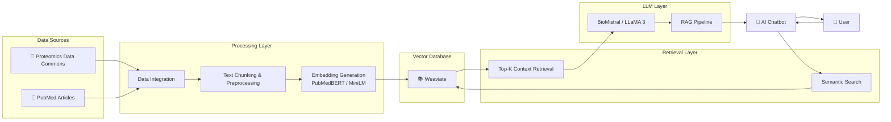

# 🧬 RAG-based AI Chatbot for Proteomics Data (PDC)

## 🎯 Project Highlights

- Built a Retrieval-Augmented Generation (RAG) chatbot for biomedical data exploration
- Integrated Proteomics Data Commons (PDC) study and publication metadata
- Used Weaviate vector database for semantic retrieval
- Implemented biomedical embeddings using PubMedBERT and Sentence Transformers
- Evaluated BioMistral and LLaMA 3 for biomedical question answering
- Enabled natural language interaction with proteomics datasets

 ## 💡 Example Queries

- What is Study PDC000251?
- What disease types are associated with PDC000220?
- How many cases and aliquots are in PDC000303?
- List studies related to metabolomics.
- What experimental strategies are used in this study?
- Are there any kidney cancer studies in PDC?
- What publications are associated with this study?

## 🔄 RAG Workflow

1. User submits a natural language query.
2. Query is converted into vector embeddings.
3. Weaviate performs semantic similarity search.
4. Relevant study metadata and publication content are retrieved.
5. Retrieved context is passed to the LLM.
6. The LLM generates a grounded response.
7. The answer is returned to the user.

## 📈 Results

The chatbot successfully answered study-level questions involving:

- Disease types
- Experimental strategies
- Case and aliquot counts
- Publication retrieval
- Proteomics study metadata

The RAG pipeline demonstrated strong performance on fact-based retrieval tasks while highlighting areas for improvement in broad aggregation and counting queries.

## 🚀 Future Enhancements

- Deploy chatbot as a web application
- Improve retrieval accuracy with hybrid search
- Add citation-aware responses
- Expand support for additional CRDC datasets
- Implement conversation memory
- Fine-tune biomedical language models

## 🏆 Skills Demonstrated

- Generative AI
- Retrieval-Augmented Generation (RAG)
- Vector Databases
- Semantic Search
- Biomedical NLP
- Large Language Models (LLMs)
- Python
- Weaviate
- Hugging Face
- Data Integration
- Information Retrieval

## 🏗️ System Architecture

